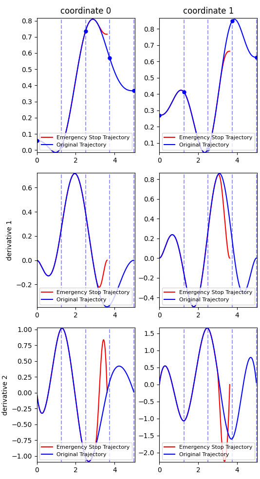

# Minimum-Time Path-Consistent Stopping Library for Collaborative Robots

Smooth stopping of collaborative robots is crucial in environments where safety is essential.
However, abrupt stops can result in potential collisions; therefore, a collision-free stop must lie within the original collision-free path.
This computes a minimum-time stopping trajectory along a collision-free path. It is based on the [gsplines library](https://github.com/rafaelrojasmiliani/gsplines_cpp).

The core feature of this library is the formulation of a time minimization problem for a specific-kind of stopping parametrization of a curve (a [gspline](https://github.com/rafaelrojasmiliani/gsplines_cpp) curve) with smoothness constraints.

This means that when an emergency stop is initiated, the robot will minimize the stopping time by decelerating smoothly along its original path rather than deviating.
In addition, smoothness and torque constrains ensure a gentle and a dynamically feasible stop.

This library is particularly useful in scenarios where robots work in close proximity to humans or other robots, and an immediate yet safe stop is essential due to an unexpected event or emergency.

# Example

```python
import gsplines
import gsplines.plot as gplot
import numpy as np
import opstop
from gsplines.optimization import minimum_jerk_path


model_file = 'path_to_urdf_robot_description'

dim = 7   # number of joints of the robot
# Generate a random numpy array of wayponts
# (each row is a waypoint in R^n)
number_of_waypoints = 5
waypoints = np.random.rand(number_of_waypoints, dim)
# The a minimum jerk trajectory with execution time of 5s
trj = minimum_jerk_path(waypoints).linear_scaling_new_execution_time(5.0)
# Select the time to stop as the 60% of the time.
stop_ti = trj.get_domain()[1]*0.6
# Get a parametrization that minimizes the time and  does not
# allow an increment in the acceleration larger than 50%
optimal_parametrization = opstop.minimum_time_bounded_acceleration(
    trj, stop_ti, 1.5, str(model_file), 8)
# Obtain the stopping trajectory
stop_trj = trj.compose(optimal_parametrization)
# Plot the nominal and the stopping trajectory
gplot.plot_compare([stop_trj, trj], ['red', 'blue'], [
                   'Emergency Stop Trajectory',
                   'Original Trajectory'], _show=True, _up_to_deriv=2)
```

# Publications

This library was used to publish

- Rojas, Rafael A., Andrea Giusti, and Renato Vidoni. "Online Computation of Time-Optimization-Based, Smooth and Path-Consistent Stop Trajectories for Robots." Robotics 11.4 (2022): 70. (**We published here primarily due to an impending deadline, though a more prestigious journal could have been an option under different circumstances**)
```
@article{rojas2022online,
  title={Online Computation of Time-Optimization-Based, Smooth and Path-Consistent Stop Trajectories for Robots},
  author={Rojas, Rafael A and Giusti, Andrea and Vidoni, Renato},
  journal={Robotics},
  volume={11},
  number={4},
  pages={70},
  year={2022},
  publisher={MDPI}
}
```
